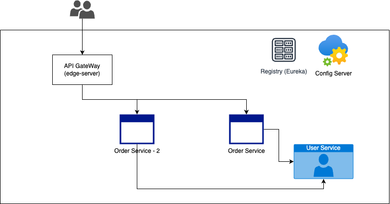

# Spring Cloud Burger Microservice Architecture

This repository contains a microservice architecture for a burger ordering system built using Spring Cloud. The project is divided into several modules, each representing a different microservice.

## Architecture Diagram




## Modules

1. **registry**: 
   - Service registry for managing microservice instances.
   - Uses Eureka for service discovery.
   - Keeps track of all running instances of each microservice.
   - Allows microservices to discover and communicate with each other dynamically.

2. **config**: 
   - Contains configuration files and scripts for the project.
   - Includes common configurations shared across all microservices, such as database configurations, security settings, and service discovery configurations.

   - You can check configs for each service via port/serviceName/env
    i.e: `http://192.168.1.34:8888/edge/default`

3. **edge**: 
   - Acts as the API gateway for the microservices.
   - Routes incoming HTTP requests to the appropriate microservice.
   - Provides load balancing, security (e.g., OAuth2, JWT), and monitoring features.
   - Uses Spring Cloud Gateway for routing and filtering requests.

4. **user**: 
   - Manages user information and authentication.
   - Handles user registration, login, and profile management.
   - Provides user details to other services like `order`.
   - Uses a relational database (e.g., MySQL, PostgreSQL) to store user information.
   - Exposes RESTful APIs for user management.
   - Implements security features such as password hashing and token-based authentication.

5. **order**: 
   - Manages the ordering process for burgers.
   - Handles order creation, updating, and retrieval.
   - Interacts with the `user` service to get user details and the `registry` service for service discovery.
   - Uses a relational database (e.g., MySQL, PostgreSQL) to store order information.
   - Exposes RESTful APIs for order management.

6. **order-2**: 
   - An alternative or additional order management service.
   - Provides similar functionality to the `order` service.
   - Can be used for testing, redundancy, or load distribution.
   - May include additional features or optimizations not present in the `order` service.


## Getting Started

### Prerequisites

- Java 17 or higher
- Gradle 7.0 or higher
- Docker (optional, for containerized deployment)

### Building the Project

To build the entire project, run the following command from the root directory:

```sh
./gradlew build
```


### Running the Services
Each module can be run individually. Navigate to the module directory and use the following command:

```
./gradlew bootRun
```

